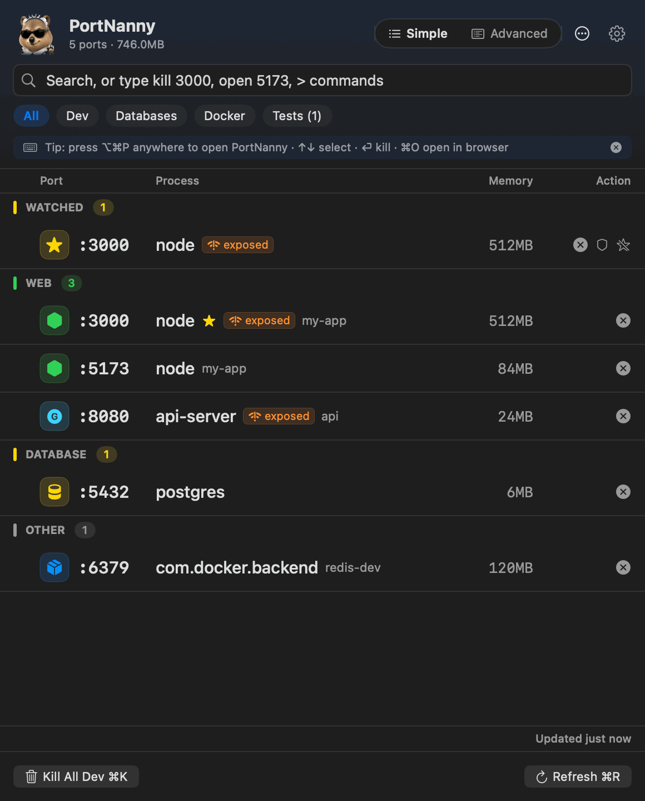

<p align="center"></p>

# PortKilla - macOS Port Manager

<p align="center"></p>

**PortKilla** is a lightweight, native macOS menu bar app that helps developers identify and kill processes occupying ports. Instantly fix `EADDRINUSE` errors, terminate stuck Node.js servers, and free up localhost ports without touching the terminal.

## 🚀 Key Features

*   **See What’s Listening**: Lists active listening TCP ports with process name, command, and memory.
*   **Process Tree View**: Expand any process to see its child processes (e.g., Python spawning worker threads).
*   **Smart Kill**:
    *   **Kill Port**: Terminates the main process.
    *   **Kill Tree**: Automatically terminates child processes (like `sleep` or worker threads) when killing the parent.
    *   **Force Kill**: Hold Option while clicking kill to send SIGKILL.
*   **Docker Integration**: Automatically detects and displays Docker container names next to mapped ports.
*   **Kill All Dev (Node.js)**: One-click bulk kill for Node.js ports (with a safe list to avoid common IDEs/tools).
*   **Test Radar (Beta)**: Detect common test runners (Jest/Vitest/Mocha/etc) and kill them from the Tests filter.
*   **History + CSV Export**: View recent kills and export to CSV.

## ⚡ Keyboard-First Workflow

The whole flow works without touching the mouse: **⌥⌘P → type "3000" or "vite" → ⏎ → dead**.

*   **⌥⌘P**: Open PortKilla from anywhere (global hotkey, no permissions needed).
*   **Type to search**: The search field is focused the moment the popover opens.
*   **↑ / ↓**: Move the selection. **→ / ←**: Expand/collapse the process tree.
*   **⏎**: Kill the selected process (**⌘⏎** force kills with SIGKILL).
*   **⌘O**: Open `http://localhost:<port>` for the selected row in your browser.
*   **⌘C**: Copy the selected port number.
*   **⌘R**: Refresh. **⌘K**: Kill all dev servers (or all tests on the Tests filter).
*   **Esc**: Clear search, then close.
*   **Option+Click ✕**: Force kill. **Shift+Click ✕**: Kill the whole process tree.

## 🛡 Signal over Noise

*   **Hide System Processes** (default on): system daemons stay out of your way — a footer hint shows how many are hidden.
*   **Exposed badge**: ports bound to `0.0.0.0`/`*` are flagged — they're reachable from your local network, not just localhost.
*   **Project detection**: each dev server shows its actual project folder (from the process working directory) — right-click to reveal it in Finder or open it in Terminal.
*   **Smart menu-bar count**: the badge counts your dev ports, not every macOS daemon.
*   **Protected processes** (shield icon): IDEs and tools are skipped by bulk kills.
*   **Launch at Login**: toggle it in Settings (⚙︎ / ⌘,).

## 🔔 Port Watchlist

Right-click any port → **Watch**. Watched ports are **pinned to the top of the list with live status** — including "free ✓" — and PortKilla notifies you the moment a watched port **frees up** (no more `EADDRINUSE` retry-loops) or when **something new grabs it**. Searching a free port number offers to watch it in one click, and a kill that's slow to finish notifies you when the port is finally available.

## 📡 More Signal

*   **Native scanner**: ports and processes are enumerated with raw kernel syscalls (libproc) — a full scan takes ~20ms with zero subprocesses.
*   **Pin as Floating Window**: keep the list on top while you work (⋯ menu).
*   **Port guards** 🛡⚡: opt-in per watched port — anything of yours that grabs a guarded port gets auto-killed, with a notification.
*   **UDP ports** are listed too (tagged `UDP`; ephemeral outgoing sockets filtered out).
*   **Age & CPU** per process in tooltips and details — Test Radar shows live CPU to expose runaway watchers.
*   **Open Project in your editor**: VS Code, Cursor, Zed, Sublime Text, and Trae are auto-detected.
*   **Configurable hotkey**: Settings → Shortcuts (default ⌥⌘P).

## ⌨️ CLI Companion

The same binary doubles as a CLI:

```bash
# optional: put it on your PATH
ln -s /Applications/PortKilla.app/Contents/MacOS/PortKilla /usr/local/bin/portkilla
```

```bash
portkilla list            # table of listening ports
portkilla list --json     # JSON output for scripts
portkilla kill 3000       # graceful kill (SIGTERM)
portkilla kill 3000 --force
```

There's also a URL scheme: `open "portkilla://kill/3000"` or `portkilla://show`.

## 🔄 Updates

PortKilla checks GitHub Releases once a day (gear menu → **Check for Updates…**) and shows a **Download vX.Y.Z** item when a newer version exists. No auto-installer — the app is unsigned (no Apple Developer program), so updates stay a deliberate download.

> **First launch note:** since the app is not notarized, macOS may warn on first open. Right-click `PortKilla.app` → **Open** → **Open** (needed once), or `xattr -dr com.apple.quarantine /Applications/PortKilla.app`.

## 💻 Requirements

- **macOS 13 (Ventura) or newer** — including the latest macOS. (Uses Ventura-era
  APIs: `SMAppService` for launch-at-login, `NavigationSplitView` for Settings.)
- **Apple Silicon and Intel** — the release is a **universal binary** (arm64 +
  x86_64), running natively on both.
- No dependencies to install; the app is fully self-contained.

## 📦 Installation

### Build from Source
PortKilla is written in native Swift for maximum performance and minimal battery impact.

```bash
git clone https://github.com/mukes555/PortKilla.git
cd PortKilla/PortKilla     # the Swift package lives in a nested dir
./scripts/build.sh
```

> Contributing? See **[CONTRIBUTING.md](CONTRIBUTING.md)** and
> **[ARCHITECTURE.md](ARCHITECTURE.md)** — `swift run PortKilla` launches the
> app in ~60s, and `swift test --disable-sandbox` runs the suite.

Build output lands in `dist/`:

- `dist/PortKilla.app`

Drag `PortKilla.app` to `/Applications`.

### Build a DMG (optional)

```bash
./scripts/build.sh --dmg
```

This produces `dist/PortKilla-1.6.0.dmg`.

To distribute to other Macs without Gatekeeper prompts, you’ll eventually want Developer ID signing + notarization.

## 🖥 Usage

1.  **Open PortKilla** from your menu bar (Lightning bolt icon).
2.  **View Active Ports**: See a categorized list of Web, Database, and other processes.
3.  **Process Tree**: Click on any row to expand and view child processes.
4.  **Free a Port**: 
    *   Click **X** to kill.
    *   **Shift+Click X** to kill the entire process tree.
    *   **Option+Click X** to force kill.
5.  **Row density & Settings**: toggle **Simple / Advanced** in the header; open **Settings** with ⚙︎ or ⌘, (sidebar-style, native).
6.  **History**: open it from the **⋯** menu to view and export past kills.

## 🤝 Contributing

Contributions welcome — see **[CONTRIBUTING.md](CONTRIBUTING.md)** for a 60-second
clone-to-run guide and **[ARCHITECTURE.md](ARCHITECTURE.md)** for the module map.

## 📄 License

MIT License. Free to use for personal and commercial development.
