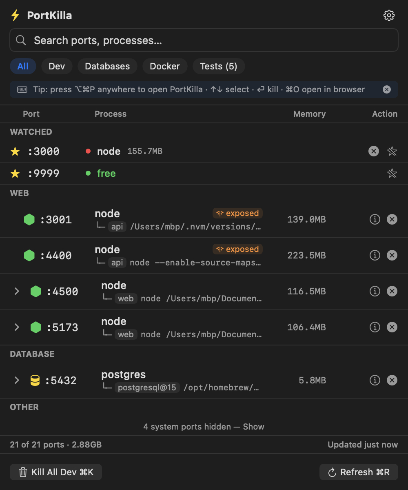

<p align="center"></p>

# PortKilla - macOS Port Manager

<p align="center">
<a href="https://github.com/mukes555/PortKilla/actions/workflows/ci.yml"></a>
<a href="https://github.com/mukes555/PortKilla/releases/latest"></a>


<a href="LICENSE"></a>
</p>

`lsof -ti:3000 | xargs kill -9` frees the port. PortKilla does the same, and
tells you *whose* server you are about to kill.

<p align="center"></p>

**PortKilla** is a lightweight, native macOS menu bar app that helps developers identify and kill processes occupying ports. Instantly fix `EADDRINUSE` errors, terminate stuck Node.js servers, and free up localhost ports without touching the terminal.

## 🎬 See it

<p align="center"></p>

## 🚀 Key Features

*   **See What’s Listening**: Lists listening TCP ports and bound UDP sockets with process name, command, and memory.
*   **Process Tree View**: Expand any process to see its child processes (e.g., Python spawning worker threads).
*   **Smart Kill**:
    *   **Kill Port**: Terminates the main process.
    *   **Kill Tree**: Automatically terminates child processes (like `sleep` or worker threads) when killing the parent.
    *   **Force Kill**: Hold Option while clicking kill to send SIGKILL.
*   **Docker Integration**: Automatically detects and displays Docker container names next to mapped ports.
*   **Kill All Dev**: One-click bulk kill for every dev server in the Web category (Node, Python, Java, Ruby, PHP, Go, nginx), with a protected list that keeps IDEs and tools safe. On the Databases or Docker tab the same button kills that category instead.
*   **Test Radar (Beta)**: Detect common test runners (Jest/Vitest/Mocha/etc) and kill them from the Tests filter.
*   **History + CSV Export**: View recent kills and export to CSV.

## ⚡ Keyboard-First Workflow

The whole flow works without touching the mouse: **⌥⌘P → type "3000" or "vite" → ⏎ → dead**.

*   **⌥⌘P**: Open PortKilla from anywhere (global hotkey, no permissions needed).
*   **Type to search**: The search field is focused the moment the popover opens.
*   **↑ / ↓**: Move the selection. **→ / ←**: Expand/collapse the process tree.
*   **⏎**: Kill the selected process (**⌘⏎** force kills with SIGKILL).
*   **⌘O**: Open `http://localhost:<port>` for the selected row in your browser.
*   **⌘C**: Copy the selected port number.
*   **⌘R**: Refresh. **⌘K**: Kill all dev servers (or all tests on the Tests filter).
*   **Esc**: Clear search, then close.
*   **Option+Click ✕**: Force kill. **Shift+Click ✕**: Kill the whole process tree.

## 🛡 Signal over Noise

*   **Hide System Processes** (default on): system daemons stay out of your way — a footer hint shows how many are hidden.
*   **Exposed badge**: ports bound to `0.0.0.0`/`*` are flagged — they're reachable from your local network, not just localhost.
*   **Project detection**: each dev server shows its actual project folder (from the process working directory) — right-click to reveal it in Finder or open it in Terminal.
*   **Connected clients**: every listener shows how many connections are open to it, and killing a server that still has clients always asks first.
*   **The Workbench**: a full window with a sortable table, ports by project, ports by agent session (with one-click clean-up of ended sessions), the watchlist, History, and an inspector that shows the evidence behind each owner.
*   **Sparklines, peers, and a peek**: the Workbench charts CPU and memory per process, lists who is connected to each server (local, LAN, elsewhere), and can show a local web server's status and title with one click.
*   **Type what you mean**: `kill 3000`, `open 5173`, `watch 8080`, `free port`, or `>` for commands, right in the search field; Return does it.
*   **Supervisors understood**: a pm2 app, a launchd job, a Docker container, or a reloader (nodemon, `next dev`, `uvicorn --reload`) would undo a plain kill, so PortKilla stops it the way its supervisor expects and shows why.
*   **Secrets stay private**: command lines are redacted (`--token=...`, `KEY=...`, URL passwords, bearer tokens) before they are shown, exported, or handed to an agent.
*   **Smart menu-bar count**: the badge counts your dev ports, not every macOS daemon.
*   **Protected processes** (shield icon): IDEs and tools are skipped by bulk kills.
*   **Launch at Login**: toggle it in Settings (⚙︎ / ⌘,).

## 🔔 Port Watchlist

Right-click any port → **Watch**. Watched ports are **pinned to the top of the list with live status** — including "free ✓" — and PortKilla notifies you the moment a watched port **frees up** (no more `EADDRINUSE` retry-loops) or when **something new grabs it**. Searching a free port number offers to watch it in one click, and a kill that's slow to finish notifies you when the port is finally available.

## 🤖 Agent-Aware (friendly-fire protection)

Running several AI coding agents? PortKilla attributes each dev server to the
**agent that started it** (Claude Code, Codex CLI, Gemini CLI, Copilot CLI,
OpenCode, Aider, Cursor, VS Code, Windsurf, Zed, Trae). No launcher, no
registry, no setup: it reads two passive signals, the process tree and the
environment markers agents leave on their children (like `CLAUDECODE=1`). The
second one survives `nohup`, pm2, and backgrounded shells, so a server keeps
its owner even after it has been reparented to launchd.

**One decision for every kill.** The CLI refuses to stop a port owned by
another agent's *running* session; the GUI warns you before you do it, bulk
dialogs say how many targets belong to running agents, and port guards never
auto-kill one. Sessions that have ended show a grey "(ended)" chip and can be
stopped by anyone. An editor terminal (VS Code, Cursor, ...) counts as "started
inside the editor", not as an agent, so it never locks a port. Commands typed in
an editor terminal are treated as a person's, except against another agent's
running server, where they need `--force`: an editor's built-in agent leaves no
marker PortKilla can see. Identified agents are also refused servers nobody
claims (most likely a person's), so they ask instead of guessing.

```bash
portkilla kill 3000
# :3000 (PID 812) is owned by Cursor (session 812), not Claude Code (session 46200)
# Refusing to kill another agent's server. Pass --force to override, or run `portkilla whoami` ...
```

- `portkilla whoami` shows how the guard sees the caller; `portkilla whois <port>`
  shows the evidence behind an owner. Tools that export no session id can set
  `PORTKILLA_SESSION`; the full compatibility matrix is in
  [docs/AGENTS.md](docs/AGENTS.md).
- `portkilla list --mine`, `--agent <name>`, `--unowned`, `--orphaned` filter by owner.
- `portkilla kill <port> --dry-run [--json]` reports the decision without signalling.
- `portkilla free <port>` (exit 0 if already free), `wait <port>`, and
  `history --port <port>` (who started and who stopped it) round out the
  agent workflow. Kills from the CLI appear in the app's History too.
- Markers seen through tmux, screen, zellij, or ssh name the agent but not
  the session, since a multiplexer inherits the environment of whoever
  started it.
- `portkilla agent-docs` prints a snippet for your CLAUDE.md / AGENTS.md so
  agents call `portkilla free` instead of `kill -9 $(lsof -ti:PORT)`;
  `--write` puts it there for you, `--claude-hook` prints a Claude Code hook
  that intercepts the old habit.
- `portkilla mcp` runs an MCP server over stdio (tools `list_ports`,
  `kill_port`, `whoami`, `wait_for_port_free`) so the guard is a tool the
  agent has rather than a convention it remembers:

  ```json
  { "mcpServers": { "portkilla": { "command": "portkilla", "args": ["mcp"] } } }
  ```
- Export `PORTKILLA_OWNER=<name>` to declare who you are and to label every
  server you start. When nothing is known about a port, PortKilla says so
  rather than guessing.

## 📡 More Signal

*   **Native scanner**: ports and processes are enumerated with raw kernel syscalls (libproc) — a full scan takes ~20ms with zero subprocesses.
*   **Pin as Floating Window**: keep the list on top while you work (⋯ menu); resizable, remembers its place, and every shortcut works in it.
*   **Port guards** 🛡⚡: opt-in per watched port (right-click → Guard, or Settings → Watched ports) — anything of yours that grabs a guarded port gets auto-killed, with a notification. Servers of a running AI agent session are never auto-killed.
*   **UDP ports** are listed too (tagged `UDP`; ephemeral outgoing sockets filtered out).
*   **Age & CPU** per process in tooltips and details — Test Radar shows live CPU to expose runaway watchers.
*   **Open Project in your editor**: VS Code, Cursor, Zed, Sublime Text, and Trae are auto-detected.
*   **Configurable hotkey**: Settings → Shortcuts (default ⌥⌘P).

## ⌨️ CLI Companion

The app bundle ships a standalone `portkilla` CLI (no AppKit, starts in a few
milliseconds), and the app binary answers the same commands:

```bash
# Homebrew installs already have `portkilla` on PATH; otherwise:
ln -s /Applications/PortKilla.app/Contents/Helpers/portkilla /usr/local/bin/portkilla
```

```bash
portkilla list            # table of listening ports (with owning agent)
portkilla list --json     # JSON output for scripts
portkilla kill 3000       # graceful kill of everything on :3000 (SIGTERM, verified)
portkilla kill 3000 --force
portkilla kill --pid 812 --dry-run --json
portkilla free 3000 && npm run dev   # exit 0 when already free
portkilla wait 3000 --timeout 30     # block until the port is free
portkilla history --port 3000        # who started it, who stopped it
portkilla whoami          # which agent the friendly-fire guard thinks you are
portkilla whois 3000      # who started it, and why PortKilla thinks so
portkilla kill --orphaned # stop servers left behind by agent sessions that ended
portkilla free-port --prefer 3000    # first free port in 3000-3999, nothing else printed
portkilla schema kill     # every field of `kill --json`, documented
portkilla doctor --agents # how every AI tool is recognised on this machine
```

Exit codes: 0 done, 1 nothing listening, 2 usage, 3 refused (another agent's
live session owns it, or nobody PortKilla can name), 4 kill failed, 5 still
running after the wait, 6 managed (a supervisor would undo the kill and its
tool is not on PATH; the command to run is printed).

There's also a URL scheme: `open "portkilla://kill/3000"` or `portkilla://show`.

## 🔄 Updates

PortKilla checks GitHub Releases once a day (Settings → About → **Check for Updates…**) and shows a **Download vX.Y.Z** item when a newer version exists. No auto-installer — the app is unsigned (no Apple Developer program), so updates stay a deliberate download.

> **First launch note:** the app is not notarized, so macOS warns once. On
> macOS 15+ use System Settings → Privacy & Security → **Open Anyway**; on
> 13 and 14, right-click → **Open**. Homebrew skips all of this. Details and
> uninstall steps: [docs/FIRST-RUN.md](docs/FIRST-RUN.md).

## 💻 Requirements

- **macOS 13 (Ventura) or newer** — including the latest macOS. (Uses Ventura-era
  APIs: `SMAppService` for launch-at-login, `NavigationSplitView` for Settings.)
- **Apple Silicon and Intel** — the release is a **universal binary** (arm64 +
  x86_64), running natively on both.
- No dependencies to install; the app is fully self-contained.

## 📦 Installation

### Homebrew (recommended)

```bash
brew tap mukes555/tap
brew install --cask portkilla
```

If Homebrew asks you to trust the tap (standard for third-party casks), run
`brew trust mukes555/tap` once. The cask installs the latest universal release,
clears the Gatekeeper quarantine, and puts the `portkilla` CLI on your PATH.
Shell completions: `portkilla completions zsh` (also bash, fish). To update later:

```bash
brew reinstall --cask portkilla
```

(The cask tracks `latest`, so a plain `brew upgrade` does not see new releases.)

### Build from Source
PortKilla is written in native Swift for maximum performance and minimal battery impact.

```bash
git clone https://github.com/mukes555/PortKilla.git
cd PortKilla/PortKilla     # the Swift package lives in a nested dir
./scripts/build.sh
```

> Contributing? See **[CONTRIBUTING.md](CONTRIBUTING.md)** and
> **[ARCHITECTURE.md](ARCHITECTURE.md)** — `swift run PortKilla` launches the
> app in ~60s, and `swift test --disable-sandbox` runs the suite.

Build output lands in `dist/`:

- `dist/PortKilla.app`

Drag `PortKilla.app` to `/Applications`.

### Build a DMG (optional)

```bash
./scripts/build.sh --dmg
```

This produces `dist/PortKilla-1.16.0.dmg`.

To distribute to other Macs without Gatekeeper prompts, you’ll eventually want Developer ID signing + notarization.

## ❓ FAQ

**Why is it unsigned?** Notarization needs a paid Apple Developer account, which
this project does not have. The build is ad-hoc signed and reproducible
(`scripts/build.sh`), releases ship `SHA256SUMS`, and the source is here.
See [docs/FIRST-RUN.md](docs/FIRST-RUN.md).

**Why menu bar only?** It is a tool you reach for from any app, so it lives
in the menu bar (`LSUIElement`) with a global hotkey instead of a Dock icon.
Pin it as a floating window when you want it to stay.

**What does "exposed" mean?** The socket is bound to `0.0.0.0` or `*`, so it
is reachable from your local network, not just this machine. It is the one
badge that is a security signal rather than a convenience.

**How does agent attribution work without a launcher?** Two passive
signals: the process tree (server → shell → agent) and the environment
markers agents leave on their children (`CLAUDECODE=1` and friends), which
survive being reparented. No daemon, no registry. When PortKilla doesn't
know, it says so.

**Something looks wrong. How do I report it?** `portkilla doctor` (or
Settings → About → Copy debug info) gives the facts a bug report needs.

## 🖥 Usage

1.  **Open PortKilla** from your menu bar (Lightning bolt icon).
2.  **View Active Ports**: See a categorized list of Web, Database, and other processes.
3.  **Process Tree**: In Advanced density, click a row with a chevron to expand its child processes; in Simple density a click opens the details sheet.
4.  **Free a Port**: 
    *   Click **X** to kill.
    *   **Shift+Click X** to kill the entire process tree.
    *   **Option+Click X** to force kill.
5.  **Row density & Settings**: toggle **Simple / Advanced** in the header; open **Settings** with ⚙︎ or ⌘, (sidebar-style, native).
6.  **History**: open it from the **⋯** menu to view and export past kills.

## 🤝 Contributing

Contributions welcome — see **[CONTRIBUTING.md](CONTRIBUTING.md)** for a 60-second
clone-to-run guide and **[ARCHITECTURE.md](ARCHITECTURE.md)** for the module map.

## 📄 License

MIT License. Free to use for personal and commercial development.
