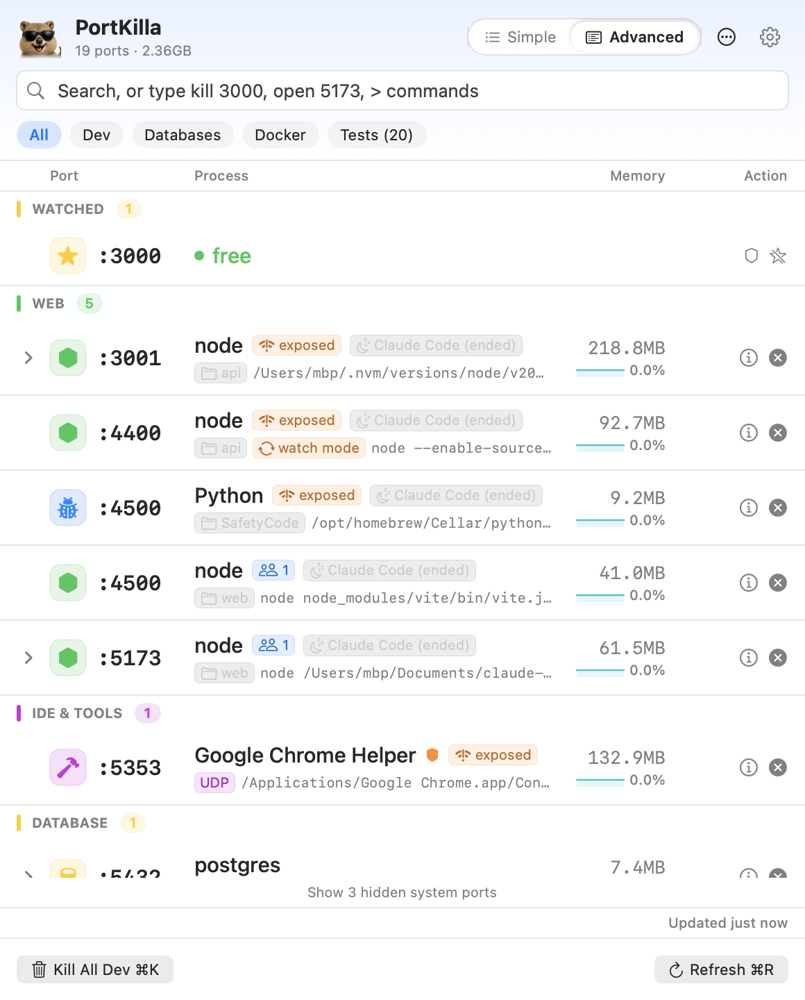
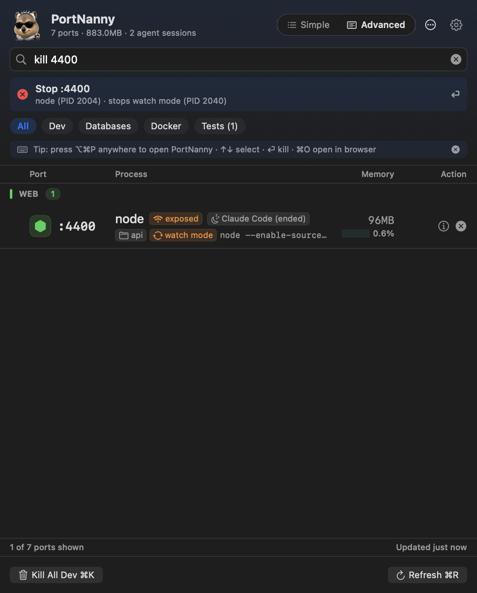
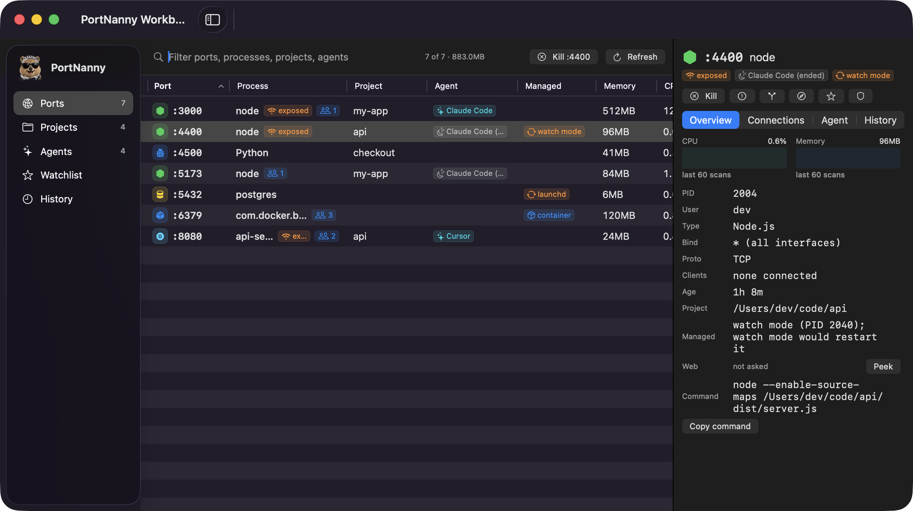

<p align="center">
  <picture>
    <source media="(prefers-color-scheme: dark)" srcset="assets/logo-dark.png">
    
  </picture>
</p>

<p align="center">
  <a href="https://github.com/mukes555/PortNanny/actions/workflows/ci.yml"></a>
  <a href="https://github.com/mukes555/PortNanny/releases/latest"></a>
  
  
  <a href="LICENSE"></a>
</p>

<p align="center">
  <b>Every listening port, who started it, and the right way to stop it.</b><br>
  A menu bar app, a Workbench window, a <code>portnanny</code> CLI, and an MCP server,<br>
  so you free ports in one keystroke and your AI agents never kill each other's servers.
</p>

<p align="center">
  <picture>
    <source media="(prefers-color-scheme: dark)" srcset="assets/screenshot-dark.png">
    
  </picture>
</p>

## In twenty seconds

<p align="center"></p>

1. <kbd>⌥</kbd><kbd>⌘</kbd><kbd>P</kbd> opens PortNanny from any app. The search field already has focus.
2. Type what you mean: `3000`, `vite`, `kill 3000`, `open 5173`, `watch 8080`, `free port`, or `>` for commands.
3. <kbd>⏎</kbd> does it. A server with clients, a lease, or a running agent behind it asks first.


It lives in the menu bar as the quokka with the count of your dev ports (not every macOS daemon). Pin it as a floating window when you want it to stay, or open the Workbench when you want the whole picture.

## Install

```bash
brew tap mukes555/tap
brew install --cask portnanny        # later: brew upgrade --cask portnanny
```

The cask installs the universal build, clears the Gatekeeper quarantine, and puts `portnanny` on your PATH. Prefer a download? Grab the DMG from [Releases](https://github.com/mukes555/PortNanny/releases/latest); the app is ad-hoc signed, not notarized, so macOS asks once (System Settings > Privacy & Security > Open Anyway on macOS 15, right-click > Open on 13 and 14). Details and uninstall steps: [docs/FIRST-RUN.md](docs/FIRST-RUN.md).

**Coming from PortKilla?** Same app, new name since 2.1. `brew upgrade --cask portnanny` follows the rename, your settings and history carry over, and the `portkilla` command, `PORTKILLA_*` variables, `portkilla://` links, and the old repository URL keep working. Details in [docs/FIRST-RUN.md](docs/FIRST-RUN.md#upgrading-from-portkilla).

Without Homebrew, the CLI ships inside the app:

```bash
ln -s /Applications/PortNanny.app/Contents/Helpers/portnanny /usr/local/bin/portnanny
portnanny completions zsh            # also bash and fish
```

## The popover



- **Type what you mean.** `kill 3000`, `open 5173`, `watch 8080`, `free port`, `>` commands. Return runs it; the bar says exactly what will happen.
- **Every row tells you enough to decide.** A type tile, the port, the process, and chips for what matters: `exposed` on all interfaces, connected clients, the agent session that started it (teal while it runs, grey once it ended), project, container, a lease, a supervisor.
- **Two densities, three sizes.** Simple shows the essentials; Advanced adds the command, project chips, CPU with a trend line, and the process tree. Compact, Regular, or Large in Settings.
- **Calm until you point.** Kill is always there, and Details in Advanced. Open in browser and Watch fade in on hover (VoiceOver has them as row actions). <kbd>⌥</kbd>-click force kills, <kbd>⇧</kbd>-click takes the whole tree.
- **Supervisors understood.** pm2, launchd, Docker, nodemon, `next dev`, `uvicorn --reload`: a plain kill would be undone, so PortNanny stops it the way its supervisor expects and says so first.
- **Watch and guard.** Watched ports sit on top with live status, including "free", and notify you when they change. A guard auto-kills whatever grabs a port, except a running agent's server.
- **Filters and bulk kills.** All, Dev, Databases, Docker, Tests. <kbd>⌘</kbd><kbd>K</kbd> kills the current filter, skipping protected tools and supervised servers.

## The Workbench

<p align="center"></p>

- **Ports** as a sortable table with project, agent, supervisor, memory, CPU, trend, and age.
- **Projects** groups servers by folder; **Agents** groups them by session, with one click to clean up what an ended session left behind.
- **Watchlist** holds watched ports, guards, and port leases; **History** knows who started and who stopped every port, with CSV export.
- **The inspector** shows who is connected (local, LAN, elsewhere), the evidence behind the owner, the port's history, and a one-click peek at a local web server's status and title.

## For AI agents


Running Claude Code, Codex, Cursor, and friends side by side means `kill -9 $(lsof -ti:3000)` eventually kills the wrong server. PortNanny attributes every dev server to the agent session that started it, from two passive signals: the process tree, and the environment markers agents leave on their children (`CLAUDECODE=1` and the like), which survive `nohup`, pm2, and reparenting. No launcher, no registry.

**One rule everywhere.** An agent that asks to stop another agent's running server, or a server nobody claims, is refused and told why. You get a notification and decide. People are warned, never refused. Ended sessions and editor terminals never lock a port.

```bash
$ portnanny kill 3000
:3000 (PID 812) is owned by Cursor (session 812), not Claude Code (session 46200)
Refusing to kill another agent's server. Ask the user, or start yours on a free port.
```

Set the tools up in one go, or piece by piece:

```bash
portnanny setup                                  # asks per tool; --yes applies everything
portnanny agent-docs --claude|--codex|--cursor|--windsurf   # rule files the tools read
portnanny mcp --setup                            # MCP registration for Claude Code, Cursor, Codex
claude plugin marketplace add mukes555/PortNanny && claude plugin install portnanny@portnanny
```

The MCP server (`portnanny mcp`) exposes `list_ports`, `whois_port`, `kill_port`, `free_port`, `reserve_port`, `release_port`, `whoami`, and `wait_for_port_free`, so the guard is a tool the agent has rather than a habit it must remember. Ports can be leased before use: `portnanny exec --free-port -- npm run dev` picks a free port, leases it, sets `PORT`, and labels the server; `reserve 3000 --for 10m` holds one by hand. Tools without a session id can export `PORTNANNY_OWNER` and `PORTNANNY_SESSION`. The full compatibility matrix is in [docs/AGENTS.md](docs/AGENTS.md).

## The CLI

Starts in a few milliseconds, no AppKit, and every command has `--json` and a documented schema (`portnanny schema kill`).

```bash
portnanny list [--json] [--mine | --agent <name> | --unowned | --orphaned]
portnanny kill 3000 [--force] [--dry-run]        # SIGTERM, verified; also by --pid
portnanny free 3000 && npm run dev               # exit 0 when already free
portnanny wait 3000 --timeout 30                 # block until the port is free
portnanny whois 3000                             # who started it, and the evidence
portnanny whoami                                 # how the guard sees the caller
portnanny history --port 3000 [--all]            # kills, and refusals with --all
portnanny free-port --prefer 3000                # first free port in 3000-3999
portnanny exec --free-port -- npm run dev        # leased, attributed, PORT set
portnanny reserve 3000 --for 10m                # hold a free port; release, reservations
portnanny drift                                  # servers off the port their config names
portnanny kill --orphaned                        # left behind by ended agent sessions
portnanny doctor --agents                        # how every AI tool is recognised here
```

Exit codes: `0` done, `1` nothing listening, `2` usage, `3` refused, `4` kill failed, `5` still running after the wait, `6` a supervisor would undo the kill and its tool is not on PATH (the command to run is printed), `70` PortNanny itself failed (for example, the JSON could not be encoded). There is a URL scheme too: `open "portnanny://kill/3000"` (add `?force=1` for SIGKILL; both ask first) or `portnanny://show`.

## Keyboard

| Keys | Action |
| --- | --- |
| <kbd>⌥</kbd><kbd>⌘</kbd><kbd>P</kbd> | Open PortNanny from anywhere (changeable in Settings) |
| <kbd>↑</kbd> <kbd>↓</kbd>, <kbd>→</kbd> <kbd>←</kbd> | Move the selection, expand or collapse the tree |
| <kbd>⏎</kbd>, <kbd>⌘</kbd><kbd>⏎</kbd> | Kill the selection, force kill |
| <kbd>⌘</kbd><kbd>O</kbd>, <kbd>⌘</kbd><kbd>C</kbd> | Open `localhost:<port>`, copy the port |
| <kbd>⌘</kbd><kbd>K</kbd>, <kbd>⌘</kbd><kbd>R</kbd> | Kill the current filter, refresh |
| <kbd>⌘</kbd><kbd>,</kbd>, <kbd>Esc</kbd> | Settings; clear the search, then close |

## Settings

- **General:** launch at login, refresh interval, confirm before killing, a switch per notification (port freed, port taken, guard, refusal), watched ports and their guards, history length.
- **Display:** popover size, row density, hide system processes, UDP sockets, and ephemeral ports, automatic peeks, the menu bar icon (traced quokka or the color app icon) and count.
- **Agents:** the AI tools on this Mac, the guard's switch for servers nobody claims, a project setup with a click per step, and leases with their default length.
- **Shortcuts:** the global hotkey and a list of everything else.
- **Protected:** process names that bulk kills never touch (IDEs and tools by default).
- **About:** updates (a daily check you can turn off, betas if you want them, downloaded by you), debug info for bug reports, reset.

## Privacy and safety

No accounts, no telemetry. The only network request is the daily release check. Command lines are redacted (`--token=`, `KEY=`, URL passwords, bearer tokens) before they are shown, exported, or handed to an agent. Kills are verified, bulk kills skip protected names and supervised servers, and the one automation that kills without asking, the guard, never touches a running agent's server. Ports and processes come from raw kernel calls (libproc): a full scan takes about 20 ms with no subprocesses.

## Requirements and building

macOS 13 or newer, Apple Silicon or Intel (one universal binary), nothing to install. To build it yourself:

```bash
git clone https://github.com/mukes555/PortNanny.git
cd PortNanny/PortNanny            # the Swift package is nested
./scripts/build.sh                # dist/PortNanny.app; add --dmg for a disk image
```

`swift run PortNanny` launches the app and `swift test --disable-sandbox` runs the suite. Start with [CONTRIBUTING.md](CONTRIBUTING.md) and the module map in [ARCHITECTURE.md](ARCHITECTURE.md). Security reports: [SECURITY.md](SECURITY.md). What changed when: [CHANGELOG.md](CHANGELOG.md).

## License

MIT. Free for personal and commercial use.
